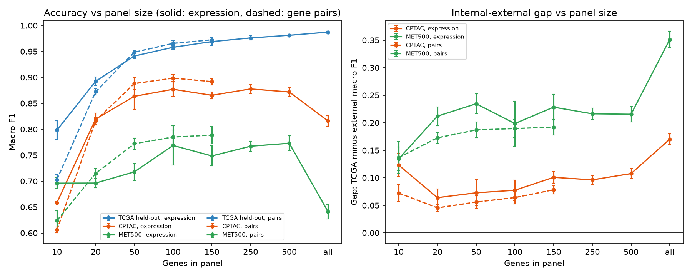
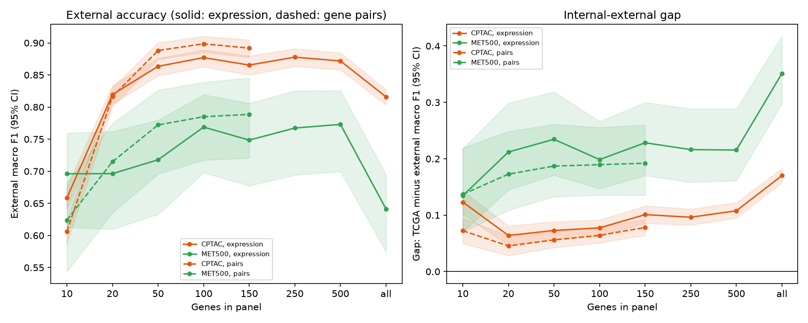
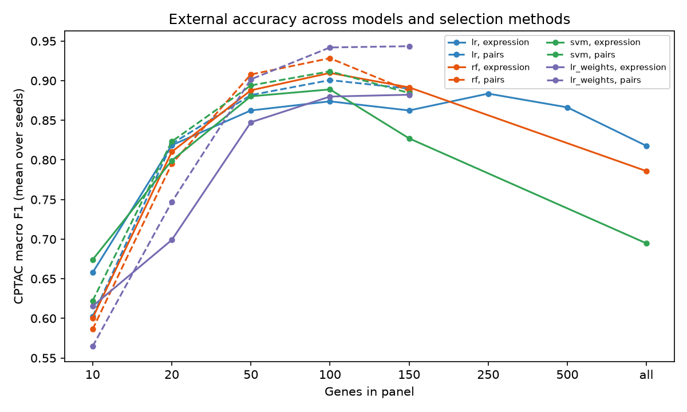
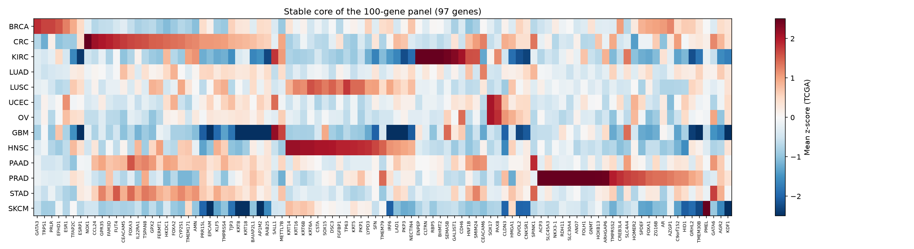

# Gene Panel Size and Rank-Based Gene Pairs in Cross-Cohort Tumour Tissue-of-Origin Classification


Code and results for the study *"Panel Size and Rank-Based Gene Pairs in Cross-Cohort Tumour Tissue-of-Origin Classification from RNA Sequencing"* by Sana Hameed (Independent Researcher; ORCID [0009-0009-8669-0949](https://orcid.org/0009-0009-8669-0949)).

## The question

Gene-expression classifiers can tell which organ a tumour came from with over 95% accuracy inside the cohort they were trained on, but accuracy drops on data from other hospitals and laboratories. Smaller gene panels would make such tests cheaper. This study asks:

- **H1:** does the gap between internal and external accuracy widen as gene panels get smaller?
- **H2:** do rank-based **gene pairs** ("gene A is higher than gene B" within one sample) reduce that gap?

Both hypotheses and their decision rules were fixed before any model was trained.

## Data and design

| Role | Cohort | Patients | Notes |
|---|---|---|---|
| Training and internal test | TCGA primary tumours | 6,101 | 13 cancer types |
| External test A | CPTAC primary tumours | 1,916 | Same processing pipeline, different institutions |
| External test B | MET500 metastases | 271 | Different laboratory and pipeline |

Panels of 10 to 500 genes and all 18,725 shared genes were compared, using expression values or gene pairs. All gene selection and tuning took place inside TCGA; models were then applied unchanged to the external cohorts.

## Main findings

| Model (logistic regression) | TCGA held-out | CPTAC | MET500 |
|---|---|---|---|
| Expression, 100 genes | 0.958 | 0.877 | 0.769 |
| **Gene pairs, 100 genes** | 0.966 | **0.899** | **0.785** |
| Expression, all genes | **0.987** | 0.816 | 0.641 |

*Macro F1, mean of five random splits.*

1. **The full transcriptome transferred worst.** It was the best model inside TCGA but the worst on both external cohorts. H1 was not supported: the gap did not widen as panels shrank.
2. **Gene pairs improved external accuracy at 50–150 genes** (CPTAC +0.022, 95% CI +0.014 to +0.028, at 100 genes). H2 was supported on CPTAC, although at 10 genes gene pairs were worse overall.
3. **The pattern held for random forest, SVM and a second gene-selection method.**
4. **Errors followed biology:** stomach tumours were confused with pancreatic and colorectal cancer, head and neck with lung squamous, ovarian with endometrial.
5. **The selected genes are tissue-identity programs**, dominated by lineage transcription factors and epithelial differentiation genes.

### Accuracy and transfer by panel size



### External accuracy with 95% confidence intervals



### Robustness across models and gene-selection methods



### The stable 100-gene panel



Full results are in the `results/` folder: summary tables (`results/primary/summary_runs.csv`), confidence intervals and hypothesis tests (`results/primary/stats/`), secondary analyses (`results/secondary/summary/`) and gene panels (`results/biology/`).

## Paper and citation

Preprint: [link to be added after posting on bioRxiv]

Software DOI: [Zenodo DOI to be added]

## How to reproduce

All data are public and are downloaded by the scripts below. Each step resumes if stopped.

### Step 1: get and check the data

Set up once:

```
python -m venv .venv
.venv\Scripts\activate          (Mac/Linux: source .venv/bin/activate)
pip install -r requirements.txt
pytest
```

Then run these in order:

| Command | What it does | Time and size |
|---|---|---|
| `python -m src.download_tcga` | TCGA expression for the 13 classes (14 projects) from UCSC Xena | A few GB; can be stopped and rerun |
| `python -m src.download_cptac --metadata-only` | Asks GDC which CPTAC tumours exist | Seconds |
| `python -m src.download_cptac` | Downloads CPTAC tumour files and combines them | About 1,500 files of ~4 MB (one sample per patient) |
| Manual: MET500 | Follow the instructions at the top of `src/met500.py` | Two files |
| `python -m src.inventory` | Counts samples per class, checks genes, units and overlap | Seconds |

The inventory answers the "Decisions to confirm" checklist in the study plan and writes:

- `data/processed/table1_counts.csv`: samples per class (Table 1 of the paper)
- `data/processed/inventory_report.txt`: the full report

### Step 2: harmonise the cohorts

```
python -m src.prepare
```

Converts all three cohorts to the same units (TPM, rescaled over shared protein-coding genes, then log2(TPM + 1)), keeps one sample per patient (polyA preferred in MET500), applies the class labels, and saves `data/processed/tcga.npz`, `cptac.npz` and `met500.npz`, plus the final Table 1.

### Step 3: the primary experiment

```
python -m src.experiment --quick      a few minutes: checks everything works
python -m src.summarize --quick
python -m src.experiment              full primary analysis (can take hours; resumes if stopped)
python -m src.summarize
```

Logistic regression with ANOVA-selected genes at 10, 20, 50, 100, 150, 250, 500 and all genes, for expression values and gene pairs (pairs up to 150 genes), over 5 random TCGA splits. Gene selection and tuning happen only inside the TCGA development set. Each run is saved to `results/primary/runs/`; the summary writes `summary_runs.csv`, `summary_by_size.csv`, `per_class_sensitivity.csv` and `figure3_panel_size.png`.

### Step 4: statistics

```
python -m src.stats
```

Bootstrap 95% confidence intervals (1,000 paired resamples, averaged over seeds), the two pre-specified hypothesis tests (H1: slope of the CPTAC gap against log2 panel size; H2: gap difference at 10, 20 and 50 genes), and clearly labelled additional analyses: external accuracy of pairs vs expression, H1 variants, per-class sensitivity, common errors, and MET500 accuracy by biopsy site and tumour content. Output: `results/primary/stats/`.

### Step 5: secondary analyses

```
python -m src.secondary prepare      extra test sets: TCGA metastases, MET500 lung
python -m src.secondary extra        primary models rerun, predicting the extra sets
python -m src.secondary models       random forest and SVM
python -m src.secondary selection    He et al.-style gene selection
python -m src.secondary summary      report and figure
```

Each part resumes if stopped; add `--quick` for a fast check. Output: `results/secondary/`.

### Step 6: biological interpretation

```
python -m src.biology
```

Stable core genes (selected in at least 4 of 5 seeds) for the pre-specified smallest reliable panel and the 100-gene panel, with gene names, the cancer type each gene is highest in, known tissue markers, a heatmap, the most informative gene-pair rules, and gene lists for Enrichr / g:Profiler. Output: `results/biology/`.

## Project structure

```
src/
  common.py          classes, TCGA projects, CPTAC label rules, download helper
  download_tcga.py   step 1a
  download_cptac.py  step 1b
  met500.py          step 1c (manual download helper)
  inventory.py       step 1d
  prepare.py         step 2
  experiment.py      step 3: runs the models
  summarize.py       step 3: tables and figure
  stats.py           step 4: confidence intervals and hypothesis tests
  secondary.py       step 5: secondary analyses
  biology.py         step 6: biological interpretation
tests/
  test_*.py          every step tested on small fake files
```

`data/` is excluded from Git; the data are public and can be downloaded again with these scripts.

## Data sources

- TCGA: GDC data via the UCSC Xena GDC hub
- CPTAC: open gene expression files from the NCI Genomic Data Commons
- MET500: Robinson et al. (2017), *Nature*, expression hosted on UCSC Xena

## Use of AI tools

The analysis code was developed with assistance from Claude (Anthropic). The author designed the study, ran all analyses and checked the results.

## License

MIT
